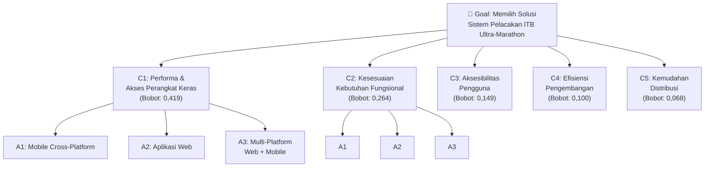
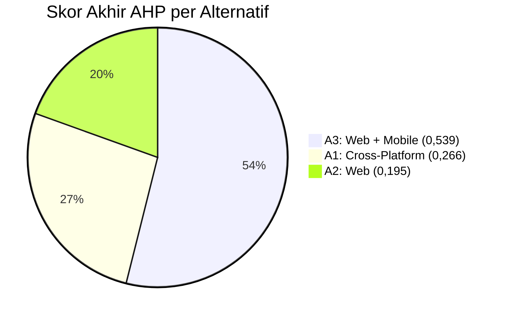

# Penjelasan Detail Perhitungan AHP pada Pemilihan Solusi

Dokumen ini menjelaskan secara rinci setiap tahap perhitungan **Analytic Hierarchy Process (AHP)** yang digunakan di **Bab III - Analisis** untuk memilih solusi terbaik bagi sistem pelacakan ITB Ultra-Marathon.

---

## 1. Struktur Hierarki AHP

AHP menyusun masalah keputusan ke dalam 3 tingkat hierarki:

### Alternatif Solusi
| Kode | Nama Alternatif | Deskripsi Singkat |
|---|---|---|
| **A1** | Mobile Cross-Platform | Satu codebase (React Native/Flutter) untuk Android & iOS |
| **A2** | Aplikasi Web | Diakses via browser, tanpa instalasi, terbatas akses GPS background |
| **A3** | Multi-Platform Web + Mobile | Aplikasi mobile untuk peserta (GPS) + web untuk panitia/penonton (UltraTrack) |

### 5 Kriteria Evaluasi
| Kode | Kriteria | Penjelasan |
|---|---|---|
| **C1** | Performa & Akses Perangkat Keras | Kemampuan akses GPS berkelanjutan, notifikasi push, sensor gerak |
| **C2** | Kesesuaian Kebutuhan Fungsional | Sejauh mana memenuhi semua kebutuhan: unggah GPX, tracking real-time, dashboard panitia |
| **C3** | Aksesibilitas Pengguna | Kemudahan akses tanpa hambatan teknis (instalasi, dll.) |
| **C4** | Efisiensi Pengembangan | Efisiensi sumber daya dalam pengembangan dan pemeliharaan |
| **C5** | Kemudahan Distribusi | Kemudahan menyebarkan sistem ke pengguna dan memperbarui |

---

## 2. Perbandingan Berpasangan Antar Kriteria

Setiap pasangan kriteria dibandingkan menggunakan **Skala Saaty (1–9)**:

| Nilai | Arti |
|---|---|
| 1 | Kedua elemen sama penting |
| 3 | Elemen pertama sedikit lebih penting |
| 5 | Elemen pertama lebih penting |
| 7 | Elemen pertama jauh lebih penting |
| 9 | Elemen pertama mutlak lebih penting |
| 2, 4, 6, 8 | Nilai kompromi |

### Matriks Perbandingan Berpasangan Antar Kriteria

|  | **C1** | **C2** | **C3** | **C4** | **C5** |
|---|---|---|---|---|---|
| **C1** | 1 | 2 | 3 | 4 | 5 |
| **C2** | 1/2 | 1 | 2 | 3 | 4 |
| **C3** | 1/3 | 1/2 | 1 | 2 | 2 |
| **C4** | 1/4 | 1/3 | 1/2 | 1 | 2 |
| **C5** | 1/5 | 1/4 | 1/2 | 1/2 | 1 |
| **Jumlah Kolom** | **2,283** | **4,083** | **7,000** | **10,500** | **14,000** |

> [!TIP]
> **Cara membaca:** C1 vs C2 = 2 artinya C1 (*Performa*) dinilai **dua kali lebih penting** daripada C2 (*Kesesuaian Fungsional*). Nilai resiprokalnya otomatis: C2 vs C1 = 1/2.

**Alasan Penilaian:** Konteks perlombaan lapangan (*outdoor ultra-marathon*) menjadikan **performa perangkat keras** (GPS, notifikasi) sebagai prioritas tertinggi, diikuti kesesuaian fungsional.

---

## 3. Normalisasi Matriks dan Perhitungan Bobot Kriteria

### Langkah Normalisasi
Setiap sel dibagi dengan **jumlah kolom** masing-masing. Contoh:
- Sel C1-C1: $1 \div 2{,}283 = 0{,}438$
- Sel C2-C1: $0{,}5 \div 2{,}283 = 0{,}219$

### Matriks Ternormalisasi + Bobot

|  | **C1** | **C2** | **C3** | **C4** | **C5** | **Bobot ($w$)** |
|---|---|---|---|---|---|---|
| **C1** | 0,438 | 0,490 | 0,429 | 0,381 | 0,357 | **0,419** |
| **C2** | 0,219 | 0,245 | 0,286 | 0,286 | 0,286 | **0,264** |
| **C3** | 0,146 | 0,122 | 0,143 | 0,190 | 0,143 | **0,149** |
| **C4** | 0,110 | 0,082 | 0,071 | 0,095 | 0,143 | **0,100** |
| **C5** | 0,088 | 0,061 | 0,071 | 0,048 | 0,071 | **0,068** |

> [!NOTE]
> **Bobot** dihitung sebagai **rata-rata baris** dari matriks ternormalisasi.
> Contoh C1: $(0{,}438 + 0{,}490 + 0{,}429 + 0{,}381 + 0{,}357) \div 5 = 0{,}419$

### Kesimpulan Bobot Kriteria
Urutan prioritas kriteria (dari terpenting):
1. **C1 — Performa & Akses Perangkat Keras: 41,9%**
2. **C2 — Kesesuaian Kebutuhan Fungsional: 26,4%**
3. **C3 — Aksesibilitas Pengguna: 14,9%**
4. **C4 — Efisiensi Pengembangan: 10,0%**
5. **C5 — Kemudahan Distribusi: 6,8%**

---

## 4. Uji Konsistensi Kriteria

Uji konsistensi memastikan penilaian tidak saling bertentangan secara logis.

### Langkah 1: Hitung $\lambda_{\max}$

Matriks perbandingan asli dikalikan dengan vektor bobot untuk mendapatkan *weighted sum vector*. Lalu setiap elemennya dibagi dengan bobot kriteria yang bersangkutan, kemudian dirata-ratakan:

$$\lambda_{\max} = rac{1}{5}\left(rac{2{,}134}{0{,}419} + rac{1{,}344}{0{,}264} + rac{0{,}757}{0{,}149} + rac{0{,}504}{0{,}100} + rac{0{,}343}{0{,}068}
ight) = 5{,}070$$

### Langkah 2: Hitung Consistency Index (CI)

$$CI = rac{\lambda_{\max} - n}{n - 1} = rac{5{,}070 - 5}{4} = 0{,}018$$

### Langkah 3: Hitung Consistency Ratio (CR)

$$CR = rac{CI}{RI} = rac{0{,}018}{1{,}12} = 0{,}016$$

> [!IMPORTANT]
> **Nilai RI** untuk matriks berukuran $n = 5$ adalah **1,12** (tabel standar Saaty).
> **CR = 0,016 ≤ 0,10** → Penilaian dinyatakan **KONSISTEN** ✅

---

## 5. Perbandingan Berpasangan Antar Alternatif (per Kriteria)

Langkah yang sama (perbandingan berpasangan → normalisasi → bobot) dilakukan untuk ke-3 alternatif pada **setiap** kriteria. (Nilai CR untuk matriks 3x3 menggunakan RI = 0,58).

### Kriteria C1: Performa & Akses Perangkat Keras

|  | **A1** | **A2** | **A3** | **Bobot** |
|---|---|---|---|---|
| **A1 (Cross-Platform)** | 1 | 5 | 1/3 | **0,292** |
| **A2 (Web)** | 1/5 | 1 | 1/6 | **0,081** |
| **A3 (Web+Mobile)** | 3 | 6 | 1 | **0,627** |

**CR: 0,082 (Konsisten)**

**Alasan:** A3 paling unggul karena komponen mobile-nya dioptimalkan penuh untuk GPS berkelanjutan, sementara web-nya tidak dibebani keterbatasan tersebut. A2 paling lemah karena keterbatasan kritis akses GPS latar belakang di browser.

---

### Kriteria C2: Kesesuaian Kebutuhan Fungsional

|  | **A1** | **A2** | **A3** | **Bobot** |
|---|---|---|---|---|
| **A1 (Cross-Platform)** | 1 | 3 | 1/2 | **0,320** |
| **A2 (Web)** | 1/3 | 1 | 1/4 | **0,123** |
| **A3 (Web+Mobile)** | 2 | 4 | 1 | **0,557** |

**CR: 0,016 (Konsisten)**

**Alasan:** A3 memenuhi *seluruh* kebutuhan fungsional secara optimal per kelompok pengguna. A1 juga baik, namun A3 memberikan fleksibilitas antarmuka yang lebih kaya untuk panitia (via web) dan pelari (via mobile).

---

### Kriteria C3: Aksesibilitas Pengguna

|  | **A1** | **A2** | **A3** | **Bobot** |
|---|---|---|---|---|
| **A1 (Cross-Platform)** | 1 | 1/3 | 1/2 | **0,164** |
| **A2 (Web)** | 3 | 1 | 2 | **0,539** |
| **A3 (Web+Mobile)** | 2 | 1/2 | 1 | **0,297** |

**CR: 0,008 (Konsisten)**

**Alasan:** A2 paling unggul (tanpa instalasi, akses dari browser manapun). A3 cukup baik karena hanya peserta yang perlu install mobile app; panitia & penonton akses via web.

---

### Kriteria C4: Efisiensi Pengembangan

|  | **A1** | **A2** | **A3** | **Bobot** |
|---|---|---|---|---|
| **A1 (Cross-Platform)** | 1 | 2 | 1/3 | **0,230** |
| **A2 (Web)** | 1/2 | 1 | 1/5 | **0,122** |
| **A3 (Web+Mobile)** | 3 | 5 | 1 | **0,648** |

**CR: 0,003 (Konsisten)**

**Alasan:** A3 paling efisien jangka panjang karena setiap komponen dikembangkan dengan teknologi yang paling sesuai, meminimalkan *workaround* teknis.

---

### Kriteria C5: Kemudahan Distribusi

|  | **A1** | **A2** | **A3** | **Bobot** |
|---|---|---|---|---|
| **A1 (Cross-Platform)** | 1 | 1/3 | 1/2 | **0,164** |
| **A2 (Web)** | 3 | 1 | 2 | **0,539** |
| **A3 (Web+Mobile)** | 2 | 1/2 | 1 | **0,297** |

**CR: 0,008 (Konsisten)**

**Alasan:** A2 paling unggul (cukup akses URL). A3 kompetitif karena komponen web bisa diperbarui instan, hanya mobile yang perlu distribusi ke peserta saja.

---

## 6. Perhitungan Skor Akhir

Skor akhir setiap alternatif = **jumlah tertimbang** dari (bobot lokal alternatif pada tiap kriteria × bobot kriteria tersebut):

$$	ext{Skor}_{Ai} = \sum_{j=1}^{5} w_{Ai,Cj} 	imes w_{Cj}$$

| Alternatif | C1 × 0,419 | C2 × 0,264 | C3 × 0,149 | C4 × 0,100 | C5 × 0,068 | **Skor Akhir** | **Peringkat** |
|---|---|---|---|---|---|---|---|
| **A1 (Cross-Platform)** | 0,292 × 0,419 = 0,122 | 0,320 × 0,264 = 0,084 | 0,164 × 0,149 = 0,024 | 0,230 × 0,100 = 0,023 | 0,164 × 0,068 = 0,011 | **0,266** | 2 |
| **A2 (Web)** | 0,081 × 0,419 = 0,034 | 0,123 × 0,264 = 0,032 | 0,539 × 0,149 = 0,080 | 0,122 × 0,100 = 0,012 | 0,539 × 0,068 = 0,037 | **0,195** | 3 |
| **A3 (Web+Mobile)** | 0,627 × 0,419 = 0,263 | 0,557 × 0,264 = 0,147 | 0,297 × 0,149 = 0,044 | 0,648 × 0,100 = 0,065 | 0,297 × 0,068 = 0,020 | **0,539** | **1 🏆** |

---

## 7. Hasil Akhir dan Keputusan

> [!IMPORTANT]
> **Alternatif 3 (Aplikasi Multi-Platform Web + Mobile)** memperoleh skor tertinggi **(0,539)** dan dipilih sebagai solusi yang dikembangkan.

### Mengapa A3 Menang?

| Keunggulan | Penjelasan |
|---|---|
| **Dominan di C1 (bobot 41,9%)** | Skor lokal 0,627 — komponen mobile dioptimalkan penuh untuk GPS berkelanjutan |
| **Dominan di C2 (bobot 26,4%)** | Skor lokal 0,557 — memenuhi seluruh kebutuhan fungsional setiap kelompok pengguna |
| **Dominan di C4 (bobot 10%)** | Skor lokal 0,648 — setiap komponen dikembangkan dengan teknologi paling sesuai |
| **Cukup baik di C3 & C5** | Mayoritas pengguna (panitia, penonton, supporter) tetap akses via web tanpa install |

### Mengapa Alternatif Lain Kalah?

| Alternatif | Kelemahan Utama |
|---|---|
| **A1 (Cross-Platform)** | Peringkat 2 (0,266). Satu codebase untuk semua → antarmuka kurang optimal untuk setiap kelompok pengguna |
| **A2 (Web)** | Peringkat 3 (0,195). Unggul di aksesibilitas & distribusi, tapi **gugur di C1** karena tidak bisa akses GPS latar belakang |
